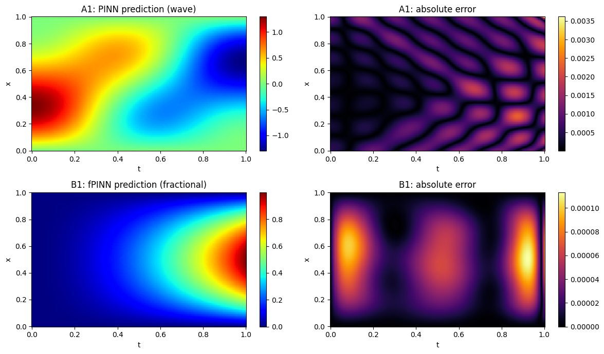

# Physics-Informed Neural Networks for Mechanics

**Data Driven Solutions and Discoveries in Mechanics Using Physics Informed Neural Networks**

**Author:** ES Sukruth ([@SUKRUTH-ES](https://github.com/SUKRUTH-ES))

---

## Overview

A Physics-Informed Neural Network (PINN) builds the governing differential equation directly into the network's loss function, using automatic differentiation. The network learns a solution that fits the physics, the boundary and initial conditions, and any available measurements together.

This project covers both **data-driven solutions** (forward problems) and **data-driven discoveries** (inverse problems) for two mechanics problems:

| Part | Method | Problem | Task |
|---|---|---|---|
| A1 | Standard PINN | 1D wave equation (vibrating string) | Forward: predict u(x, t) |
| A2 | Standard PINN | 1D wave equation | Inverse: discover the wave speed c from noisy data |
| A3 | Standard PINN | 1D wave equation | Extension: robustness to 0–10% measurement noise |
| B1 | Fractional PINN (fPINN) | Time-fractional diffusion (anomalous / fractional consolidation) | Forward solution with a Caputo derivative (L1 scheme) and hard constraints |
| B2 | Fractional PINN (fPINN) | Time-fractional diffusion | Inverse: discover the fractional order α from noisy data |

## Key results

| Experiment | Metric | Result |
|---|---|---|
| A1 – Wave forward | Relative L2 error | **1.23 × 10⁻³** |
| A1 – Wave forward | PDE loss on training points / test points | 1.39 × 10⁻⁵ / 1.66 × 10⁻⁵ |
| A2 – Wave inverse (1% noise) | Learned c (true 1.0, initial guess 0.5) | **1.00021** (0.021% error) |
| A3 – Noise study | Error in c for 0%, 1%, 5%, 10% noise | below 0.011% at every level |
| B0 – L1 operator check | Convergence rate (theory: 2 − α = 1.5) | **1.49** |
| B1 – fPINN forward (α = 0.5) | Relative L2 error | **1.26 × 10⁻⁴** |
| B2 – fPINN inverse (1% noise) | Learned α (true 0.5, initial guess 0.8) | **0.50332** (0.66% error) |

## Repository structure

```
.
├── PINN_Mechanics.ipynb      # Full notebook: Parts A and B, with explanations
├── requirements.txt
├── README.md
├── report/
│   └── writeup.pdf           # Two-page project write-up
└── results/                  # Figures, trained models (.pt) and the noise-study CSV
    ├── A_*.png, A_wave_forward.pt      # Part A1 – forward wave PINN
    ├── A2_*.png, A2_wave_inverse.pt    # Part A2 – inverse (wave speed c)
    ├── A3_noise_study.png / .csv       # Part A3 – noise study
    ├── B_*.png, B_fpinn_forward.pt     # Part B1 – forward fPINN
    ├── B2_*.png, B2_fpinn_inverse.pt   # Part B2 – inverse (fractional order α)
    └── demo_reloaded_models.png        # Demo: predictions from the reloaded models
```

## Setup and running

### Option 1 – Google Colab (recommended)
1. Open `PINN_Mechanics.ipynb` in Google Colab.
2. Select **Runtime → Change runtime type → T4 GPU**.
3. Click **Runtime → Run all**. The full training takes about 20 minutes on a T4.

### Option 2 – Local machine
```bash
git clone https://github.com/SUKRUTH-ES/PINN_Mechanics.git
cd PINN_Mechanics
python -m venv venv
source venv/bin/activate        # Windows: venv\Scripts\activate
pip install -r requirements.txt
jupyter notebook PINN_Mechanics.ipynb
```
A CUDA GPU is recommended. On a CPU, training is about 10× slower.

### Quick demo (no retraining)
Trained models are saved in `results/`. To reproduce the results in seconds:
1. Upload the `results/` folder to Colab (or keep it next to the notebook locally).
2. Run the setup and definition cells, which take a few seconds and do not train anything: Cells 3, 5, 7, 9, 21, 22, 31, 32, 34, 35, 39, 40.
3. Run the **Demo** cell at the end of the notebook. It loads all four models and prints their metrics and plots.

Expected output (verified by reloading the saved models in a fresh Colab session):

```
A1 Wave PINN forward   | Rel. L2 = 1.229e-03
A2 Wave PINN inverse   | c     = 1.00021  (true 1.0)
B1 fPINN forward       | Rel. L2 = 1.260e-04
B2 fPINN inverse       | alpha = 0.50332  (true 0.5)
```



## Method summary

**Loss function (standard PINN):**

L = w_f · L_PDE + w_b · L_BC + w_i · L_IC (+ w_d · L_data for inverse problems)

- Network: fully connected, 4 hidden layers × 64 neurons, tanh activation, Xavier initialisation, inputs scaled to [−1, 1]
- Collocation points: Latin Hypercube Sampling (`scipy.stats.qmc`)
- Optimisation: Adam (10,000 iterations, learning rate 10⁻³, halved every 5,000) followed by L-BFGS
- Inverse problems: the unknown parameter (c or α) is a trainable `nn.Parameter`, learned together with the network weights

**fPINN (Part B):**
- Automatic differentiation cannot compute fractional derivatives. The Caputo derivative is approximated with the **L1 finite-difference scheme** on a structured time grid, written as a matrix product `D_alpha = U @ M.T`, while `u_xx` still comes from autograd.
- **Hard constraints** `u = t · x · (1 − x) · NN(x, t)` satisfy the initial and boundary conditions exactly, so the loss has only the PDE residual.
- For the inverse problem, the L1 operator is rewritten in PyTorch so that it is differentiable with respect to α (through `torch.lgamma` and the power terms), with α = sigmoid(a) to keep 0 < α < 1.

## References
1. Q. Zhang, Y. Chen, Z. Yang, *Data Driven Solutions and Discoveries in Mechanics Using Physics Informed Neural Network*, Stanford CS229 Project Report.
2. M. Raissi, P. Perdikaris, G. E. Karniadakis, *Physics-informed neural networks: A deep learning framework for solving forward and inverse problems involving nonlinear partial differential equations*, J. Comput. Phys. 378 (2019) 686–707.
3. G. Pang, L. Lu, G. E. Karniadakis, *fPINNs: Fractional Physics-Informed Neural Networks*, SIAM J. Sci. Comput. 41(4) (2019) A2603–A2626.
4. L. Lu, X. Meng, Z. Mao, G. E. Karniadakis, *DeepXDE: A deep learning library for solving differential equations*, SIAM Review 63(1) (2021).
